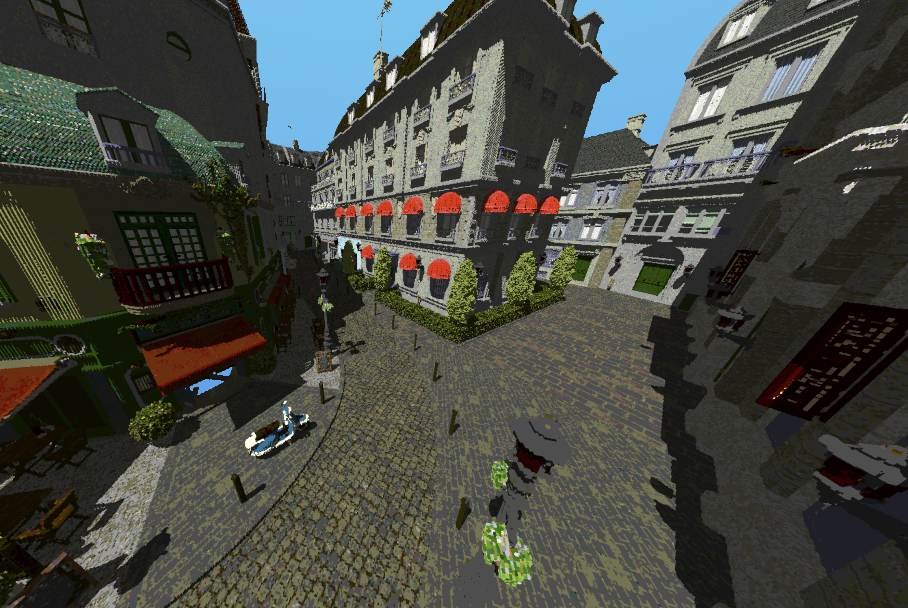

# MeshToVox
A Command line ultility to convert triangle meshes into voxels.

The utility supports loading `.gltf`/`.glb` files and saving `.vox` files.

The loading of the gltf files is partially multithreaded. Unformtunately, I do not think multithreading the voxelization (which is usually the longest step) is viable.

## CLI Usage
Usage: `mesh_to_vox [OPTIONS] --input <INPUT> --output <OUTPUT>`

Options:
-   `-i, --input <INPUT>`    The input file that will be voxelized
-   `-o, --output <OUTPUT>`  The output file after voxelization
- `--dim <DIM>`        The resolution of the output model [default: 1022]
-  `--sparse <SPARSE>`  [default: true] [possible values: true, false]
-   `-h, --help`             Print help
-   `-V, --version`          Print version

## Installation
[Cargo](https://www.rust-lang.org/tools/install 'Cargo') is requried for installation. Clone the repo and run with `cargo run --release -- (arguments)`

## Examples
This is an example of the [Amazon Lumberyard Bistro](https://developer.nvidia.com/orca/amazon-lumberyard-bistro) scene voxelized at a resolution of `4094`
