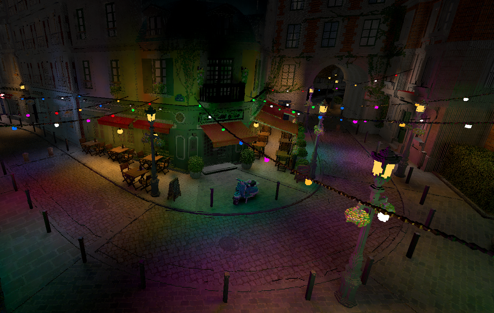
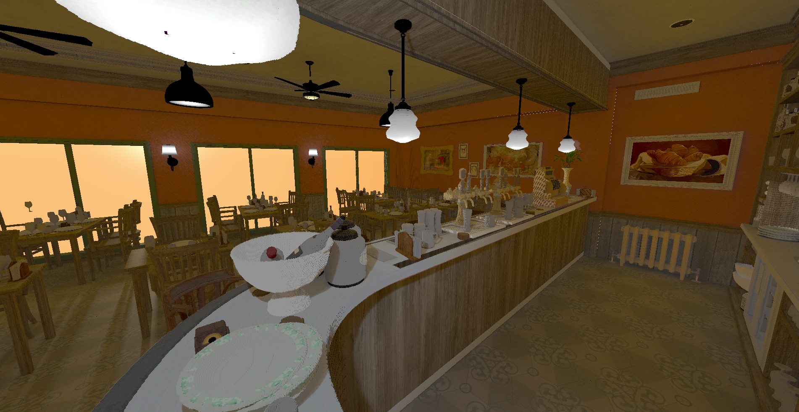
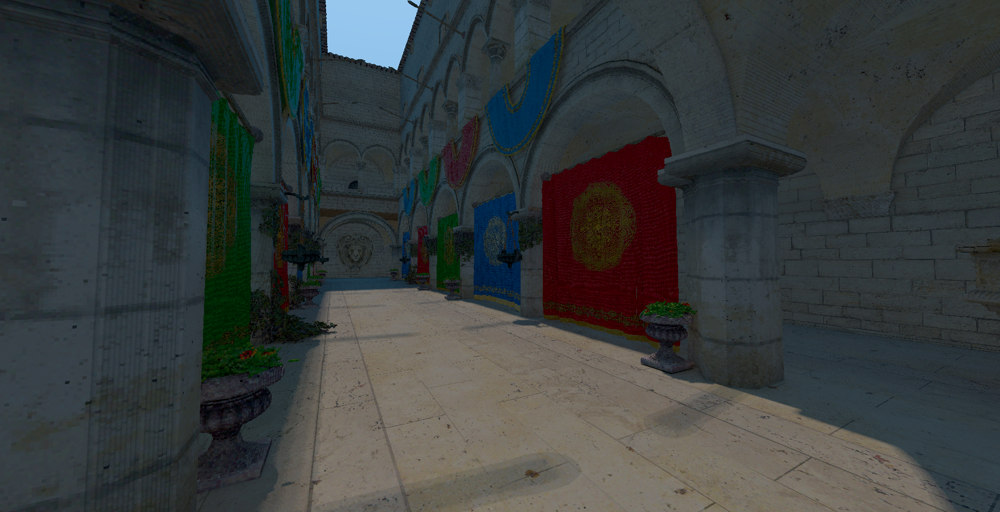

# Voxquant

A crate and a command line utility for voxelizing triangle meshes.
This is surface (triangle) only voxelization.

The crate structure is made out of the following crates:
- `voxquant` is the CLI tool that (currently) supports gltf -> magicavoxel conversion.
- `voxquant_core` provides the core voxelization algorithms and types for input/output formats to use.
- `voxquant_gltf` provides the glTF 2.0 support through the [`gltf`](https://docs.rs/gltf/latest/gltf/) crate
  - The loading is parallelized (image loading to be exact). Most of the features are supported. The only missing features that could be useful are skinning, morph targets and texture transforms.
- `voxquant_dotvox` provides magicavoxel support through the [`dot_vox`](https://docs.rs/dot_vox/latest/dot_vox/) crate
  - The voxelization is parallelized. You can use a dynamic or a static palette.

It is very easy to add support for more formats in the future / add your own formats (e.g. a direct octree output). Support for more formats may be added to the CLI tool in the future.

There's no PBR support yet. The voxels will only carry color and emissiveness information. I'd like to change that in the future. The interior of the model is not filled at all.

This project is based on an implementation made by [noahbadoa](https://github.com/noahbadoa) but the project was entirely rewritten by me to make it much more robust and performant. Big thanks!

## CLI Usage
Usage: `voxquant -i <INPUT> -o <OUTPUT> [OPTIONS] `

Options:
- `-i, --input <INPUT>`    The input file that will be voxelized
- `-o, --output <OUTPUT>`  The output file after voxelization
- `-r, --res <RES>`        The resolution of the output model [default: 1024]
- `--base-scale`           The default scale of the model [default: 1.0]
- `--mode`                 The voxelization mode (triangles / wireframe / points) [default: triangles]
- `--no-optimization`      Disables deduplication of voxels. If two triangles share a voxel, both voxels will be present in the output file
- `--color`                Chooses the palette generation mode. It defaults to dynamic, but you can choose to use a static palette instead
- `-h, --help`             Print help
- `-V, --version`          Print version

## Installation
[Cargo](https://www.rust-lang.org/tools/install 'Cargo') is requried for installation. Clone the repo and run with `cargo run -r -- (arguments)`

## Performance
All the benchmarks here use the [Amazon Lumberyard Bistro](https://developer.nvidia.com/orca/amazon-lumberyard-bistro) scene. The exact command is
`cargo run -r -- -i 'bistro_exterior.glb' -o bistro.vox --color <COLOR MODE> --base-scale 64.0 --res <RESOLUTION>`. I've just used the output times reported by the CLI tool for the measurement, these are rough estimates.

The loading of the scene takes ~1.9s.
The voxelization + save is as follows:
- color: static, resolution: 2048 - ~0.65s
- color: static, resolution: 4096 - ~1.45s
- color: static, resolution: 8192 - ~5.07s
- color: dynamic, resolution: 2048 - ~0.82s
- color: dynamic, resolution: 2048 - ~1.72s
- color: dynamic, resolution: 8192 - ~6.7s

The output is visible below

## Examples

- This is an example of the [Amazon Lumberyard Bistro](https://developer.nvidia.com/orca/amazon-lumberyard-bistro) scene voxelized at a resolution of `8192` (with scale `x64.0`)
  into magicavoxel (with a generated custom palette)
  

- I've made myself a custom format to be able to express emissiveness and use more palette colors (support for emissive materials in magicavoxel is not there yet)
  
  

- This is an example of the sponza scene voxelized at a resolution of `4096` (with scale `x64.0`)
  
